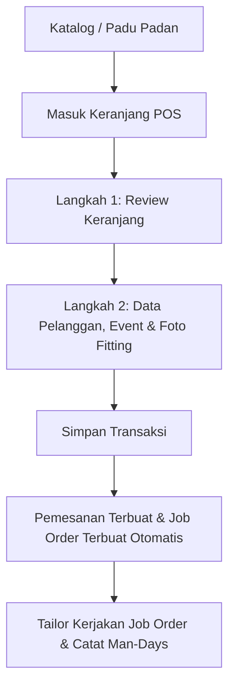

# Product Requirement Document (PRD) - Caroline Lauda Kebaya Rental System

## 1. Pendahuluan
Dokumen Kebutuhan Produk (PRD) ini mendefinisikan persyaratan fungsional, alur kerja pengguna, dan fitur utama untuk **Caroline Lauda Kebaya Rental System**. Sistem ini ditujukan untuk mendukung operasional butik sewa kebaya secara real-time, cepat, dan terintegrasi dari katalog hingga penugasan penjahit (tailor).

---

## 2. Sasaran & Ruang Lingkup
Tujuan utama sistem ini adalah:
1.  Menghilangkan kesalahan pencatatan pemesanan ganda (*double-booking*) kebaya.
2.  Menyederhanakan simulasi perpaduan atasan dan bawahan kebaya (Mix & Match).
3.  Mempercepat pencatatan transaksi sewa langsung dari tablet/mobile kasir POS.
4.  Mengotomatiskan penugasan pengerjaan permak/alterasi (Job Order) untuk staf penjahit butik setelah transaksi disimpan.
5.  Melacak efisiensi kerja staf produksi melalui audit *Man-Days* (Labor Log).

---

## 3. Persona Pengguna
Sistem membedakan akses berdasarkan dua peran utama:

| Peran | Deskripsi | Hak Akses Utama |
| :--- | :--- | :--- |
| **Owner (Pemilik)** | Pemilik butik yang memantau bisnis secara keseluruhan. | Mengelola data karyawan, mengubah konfigurasi sistem (periode proteksi sewa), melihat total nominal pendapatan, menetapkan tenggat waktu pekerjaan permak. |
| **Worker (Karyawan)** | Kasir butik, admin, dan penjahit (tailor). | Melayani transaksi POS kasir, menguji padu padan gaun, melihat kalender reservasi bulanan, mencatat jam/hari kerja permak (*Labor Logs*). |

---

## 4. Alur Kerja Pengguna (User Workflows)

### 4.1 Pencarian & Pemilihan Gaun (Katalog)
*   Staf dapat mencari gaun menggunakan kolom pencarian multi-token dinamis. Pencarian mendukung pencarian kata kunci acak (misal: `"sabrina pink M"`) yang mencocokkan nama, SKU, warna, deskripsi, ukuran, atau tag barang sewa secara instan.
*   Filter kategori cepat (`Atasan` vs `Bawahan`) mempermudah penyaringan inventaris.

### 4.2 Simulasi Setelan Pakaian (Padu Padan)
*   Staf butik dapat memilih satu atasan dan satu bawahan untuk disandingkan pada kartu pratinjau mannequin visual.
*   **Validasi Tanggal**: Sebelum memilih, staf memfilter tanggal acara. Sistem memanggil API untuk menandai gaun yang terblokir (`[Reserved]` & redup/disabled) dan gaun yang tersedia (`[Available]`).
*   **Masukkan ke Keranjang**: Staf dapat menekan tombol sekali klik untuk memasukkan kedua item setelan yang terpilih ke dalam keranjang POS, lalu mereset pratinjau mannequin agar siap digunakan untuk setelan berikutnya.

### 4.3 Kasir POS (Checkout Wizard 2-Langkah)
*   **Langkah 1 (Keranjang)**: Staf mengulas item yang akan disewa, menyesuaikan harga sewa khusus untuk diskon atau harga khusus (kustom), serta mencari dan menambahkan gaun tambahan dari kolom pencarian katalog terpadu di bawahnya.
*   **Langkah 2 (Detail Rental)**: Staf mengisi detail rental: nama pelanggan, nomor telepon aktif, nama pemesanan grup (opsional), tanggal & waktu acara (dilengkapi penentu jam pengambilan).
*   **Unggah Foto Bukti**: Staf dapat mengambil foto langsung menggunakan kamera tablet/HP atau mengunggah dari galeri:
    *   **Foto Fitting**: Dokumentasi pas-pakaian klien saat fitting.
    *   **Foto Sebelum Sewa**: Bukti kondisi fisik awal gaun sebelum disewa pelanggan guna menghindari sengketa saat pengembalian barang.

### 4.4 Pengelolaan Produksi (Job Orders & Labor Logs)
*   Ketika transaksi rental baru disimpan, backend otomatis menerbitkan instruksi tugas permak (**Job Order**) untuk masing-masing item pakaian dalam sewa tersebut.
*   Worker (penjahit) membuka tab Pekerjaan, melihat instruksi teknis alterasi, foto fitting pelanggan, dan foto detail gaun.
*   Penjahit mencatat detail log pengerjaan (*labor logs*) meliputi: nama pengerja, estimasi hari/jam pengerjaan, kategori kerajinan (borci, payet, permak, fitting, dll.), serta keterangan teknis. Ini otomatis menghitung total pengerjaan Man-Days (MD) per baju.

### 4.5 Jadwal Acara & Analisis Tren (Jadwal & Galeri Fitting)
*   **Kalender Reservasi**: Menampilkan jadwal penyewaan bulanan dengan garis indikator berwarna sesuai status transaksi sewa.
*   **Galeri Fitting Bulanan**: Menyajikan kolase visual foto-foto fitting pelanggan yang dikelompokkan berdasarkan bulan event. Pemilik butik dapat melihat nomor invoice, tanggal transaksi, nama event, serta detail baju-baju yang dipakai pelanggan untuk menganalisis model baju mana yang paling laku di setiap bulan.
