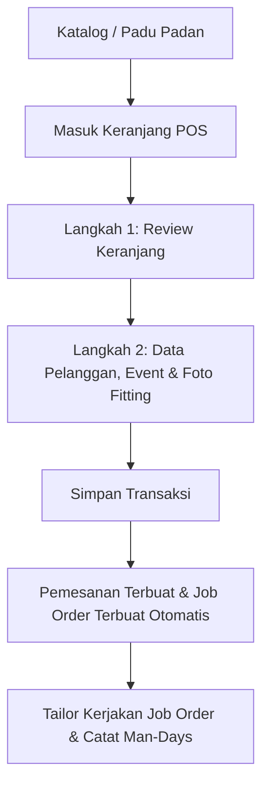

# Dokumentasi Sistem Penyewaan Kebaya - Caroline Lauda

Dokumen ini berisi Product Requirement Document (PRD), Spesifikasi Teknis, dan Dokumentasi API lengkap untuk sistem pengelolaan penyewaan kebaya **Caroline Lauda**.

---

# 1. Product Requirement Document (PRD)

## 1.1 Deskripsi Produk
Caroline Lauda Kebaya Rental System adalah platform kasir POS, katalog inventaris, dan manajemen produksi terintegrasi untuk butik persewaan kebaya. Sistem ini terdiri dari backend berbasis web (Laravel Filament) untuk manajemen data terpusat, dan frontend mobile/tablet (Flutter) untuk operasional butik sehari-hari.

## 1.2 Persona Pengguna
1.  **Pemilik Butik (Owner)**:
    *   Mengakses penuh konfigurasi sistem (seperti masa blokir reservasi).
    *   Melihat laporan keuangan (Total omset sewa pakaian).
    *   Mengelola akun karyawan butik.
    *   Menetapkan tenggat waktu/due date tugas permak pakaian.
2.  **Karyawan Butik (Worker / Tailor)**:
    *   Melayani kasir persewaan (POS checkout) dan simulasi setelan kebaya (Padu Padan).
    *   Mencatat pekerjaan permak / man-days kerja produksi di butik.
    *   Mengakses data pelanggan dan kalender reservasi.

## 1.3 Alur Kerja & Fitur Utama



### 1. Katalog & Stok
*   Menampilkan data pakaian dan aksesoris (nama, SKU, warna, tipe, ukuran bebas, harga sewa, gambar, tag).
*   Filter produk berdasarkan kategori (Atasan/Tops dan Bawahan/Bottoms) dan tag produk.
*   Pencarian multi-token yang dinamis berdasarkan nama, SKU, warna, deskripsi, ukuran, dan tag.

### 2. Padu Padan (Mix & Match)
*   Menguji setelan atasan dan bawahan pada visual pratinjau mannequin.
*   Pemeriksaan ketersediaan barang secara real-time berdasarkan kalender. Pakaian yang sudah dipesan dalam masa blokir ($\pm$ locking period) akan dinonaktifkan (dimmed) dan ditandai `[Reserved]`.
*   Tombol "Masukkan ke Keranjang" otomatis memasukkan atasan/bawahan terpilih ke keranjang belanja POS secara bersamaan.

### 3. Kasir POS & 2-Step Checkout Wizard
*   **Langkah 1 (Review Keranjang)**: Mengulas pakaian pilihan, mengubah harga sewa kustom untuk penyesuaian khusus, dan menambahkan pakaian tambahan langsung dari kolom pencarian katalog terpadu.
*   **Langkah 2 (Detail Rental)**: Mengisi data pelanggan (nama lengkap, nomor telepon, nama event, tanggal acara) serta mengambil/mengunggah foto fitting pelanggan dan foto kondisi awal gaun (sebelum sewa).
*   Penyimpanan transaksi otomatis membuat transaksi rental baru di sistem dan secara otomatis menerbitkan Job Order produksi permak untuk tim penjahit di butik.

### 4. Transaksi Rental (Rentals Tab)
*   Daftar seluruh transaksi yang terurut otomatis berdasarkan **Tanggal Event Terdekat** (Acara mendatang diurutkan menaik/ascending paling atas, acara yang telah lewat diurutkan menurun/descending di bawah).
*   Filter transaksi berdasarkan status (`booked` / dipesan, `picked_up` / diambil, `returned` / kembali, `cancelled` / batal, `void` / dibatalkan).
*   Fungsi edit detail transaksi, penyesuaian barang sewa, dan pembatalan (Void) transaksi.

### 5. Pekerjaan Produksi & Permak (Job Orders)
*   Job Order diterbitkan otomatis oleh model backend saat transaksi sewa dibuat.
*   Karyawan penjahit (tailor) dapat mencatat log pengerjaan (*labor logs*) berupa waktu (hari, jam) dan kerajinan khusus (borci, payet, permak, fitting) untuk menghitung audit Man-Days (MD).
*   Menampilkan detail instruksi teknis permak, foto fitting pelanggan, dan pratinjau thumbnail pakaian yang dapat diklik untuk diperbesar (*click-to-zoom preview*).

### 6. Kalender Jadwal Reservasi (Schedule Tab)
*   Menampilkan kalender bulanan yang menandai tanggal sewa aktif serta garis strip berwarna sebagai visualisasi periode pemblokiran sewa baju agar tidak terjadi double-booking.

### 7. Galeri Foto Fitting Bulanan (Fitting Gallery Tab)
*   Menampilkan grid foto fitting pelanggan yang dikelompokkan dan difilter per bulan.
*   Menyajikan detail nomor transaksi, tanggal acara, nama event/klien, serta daftar pakaian yang tersewa untuk memudahkan pemilik memantau tren gaun terlaris bulanan.

---

# 2. Spesifikasi Teknis

## 2.1 Arsitektur Sistem
*   **Backend**: Laravel 10 / PHP 8.2+ dengan Filament Admin Panel untuk antarmuka administratif web. Database MySQL/PostgreSQL.
*   **Frontend**: Flutter 3.x SDK / Dart untuk aplikasi client mobile (Android/iOS) dan desktop (Windows).
*   **State Management (Flutter)**: `Provider` untuk reaktivitas state keranjang belanja global dan status otentikasi.
*   **Penyimpanan Media**: Spatie Laravel Media Library untuk pengelolaan gambar pakaian, foto fitting, dan foto audit fisik gaun.

## 2.2 Aturan Pemblokiran Tanggal (Locking Period)
Untuk mencegah pakaian sewa rusak atau belum siap antara dua masa sewa, sistem memberlakukan aturan pemblokiran tanggal.
Jika penyewaan jatuh pada tanggal $T$, dan periode locking disetel sepanjang $L$ hari (diatur oleh owner di menu Settings, default 14 hari):
*   Pakaian yang sama **tidak dapat disewa** pada rentang tanggal $[T - L, T + L]$.
*   Artinya, masa proteksi pakaian setelah disewa berlangsung selama $L \times 2$ hari.
*   API ketersediaan `/api/rentals/availability` akan me-return daftar ID barang yang terblokir pada tanggal target.

## 2.3 Database Schema (Entitas Utama)

```
+--------------------+       +--------------------+       +--------------------+
|      Rentals       |------>|    RentalItems     |------>|   InventoryItems   |
+--------------------+       +--------------------+       +--------------------+
| id (PK)            |       | id (PK)            |       | id (PK)            |
| customer_name      |       | rental_id (FK)     |       | name               |
| customer_phone     |       | inventory_item_id  |       | sku                |
| event_date         |       | rental_price       |       | type (top/bottom)  |
| status             |       +--------------------+       | size               |
| group_order_name   |                                    | rental_rate        |
+--------------------+                                    +--------------------+
        |
        v
+--------------------+       +--------------------+
|     JobOrders      |------>|     LaborLogs      |
+--------------------+       +--------------------+
| id (PK)            |       | id (PK)            |
| rental_id (FK)     |       | job_order_id (FK)  |
| due_date           |       | worker_id (FK)     |
| status             |       | days / hours       |
| instructions       |       | man_days           |
+--------------------+       +--------------------+
```

---

# 3. Dokumentasi API

Seluruh API diamankan menggunakan token bearer **Laravel Sanctum**. Header `Authorization: Bearer <token>` wajib disertakan untuk semua *Protected Routes*.

## 3.1 Otentikasi

### Login Pengguna
*   **Endpoint**: `POST /api/login`
*   **Request Body**:
    ```json
    {
      "username": "karyawan_butik",
      "password": "secretpassword"
    }
    ```
*   **Response (200 OK)**:
    ```json
    {
      "token": "1|abcdef123456...",
      "user": {
        "id": 2,
        "name": "Karyawan Butik",
        "username": "karyawan_butik",
        "role": "worker",
        "is_owner": false
      }
    }
    ```

### Ubah Password
*   **Endpoint**: `POST /api/change-password`
*   **Request Body**:
    ```json
    {
      "current_password": "oldpassword",
      "new_password": "newpassword123",
      "new_password_confirmation": "newpassword123"
    }
    ```
*   **Response (200 OK)**:
    ```json
    {
      "message": "Password updated successfully"
    }
    ```

---

## 3.2 Katalog & Inventaris

### Mengambil Semua Produk Katalog
*   **Endpoint**: `GET /api/inventory`
*   **Response (200 OK)**:
    ```json
    [
      {
        "id": 1,
        "name": "pink sabrina",
        "sku": "KBY-00001",
        "type": "top",
        "size": "M",
        "color": "pink",
        "rental_rate": 650000,
        "image_url": "https://ngrok-url/storage/media/1/gown.jpg",
        "image_path": "/storage/media/1/gown.jpg",
        "tags": ["brokat", "sabrina"]
      }
    ]
    ```

---

## 3.3 Transaksi Sewa (Rentals)

### Periksa ID Produk yang Tidak Tersedia (Terblokir)
*   **Endpoint**: `GET /api/rentals/availability`
*   **Query Parameters**: `date=yyyy-MM-dd` (misal `date=2026-07-14`)
*   **Response (200 OK)**:
    ```json
    {
      "unavailable_item_ids": [3, 7, 12]
    }
    ```

### Membuat Transaksi Sewa Baru (POS Checkout)
*   **Endpoint**: `POST /api/rentals`
*   **Content-Type**: `multipart/form-data` (untuk upload file foto)
*   **Request Parameters**:
    *   `customer_name` (string, required)
    *   `customer_phone` (string, optional)
    *   `event_date` (datetime string, required)
    *   `group_order_name` (string, optional)
    *   `notes` (string, optional)
    *   `items` (array, format: `items[0][inventory_item_id]=1&items[0][rental_price]=650000`)
    *   `client_pic` (file, optional - Foto fitting)
    *   `before_photos[]` (multiple files, optional - Foto kondisi pakaian sebelum sewa)
*   **Response (201 Created)**:
    ```json
    {
      "message": "Rental created successfully",
      "rental": {
        "id": 10,
        "invoice_number": "INV-20260713-0001",
        "customer_name": "Caroline Patricia",
        "event_date": "2026-07-14T10:00:00.000Z",
        "status": "booked",
        "client_pic_url": "https://ngrok-url/storage/media/client/fitting.jpg",
        "items": [
          {
            "inventory_item_id": 1,
            "rental_price": 650000
          }
        ]
      }
    }
    ```

### Memperbarui Detail Transaksi Rental
*   **Endpoint**: `POST /api/rentals/{id}` (menggunakan POST untuk mendukung upload file) atau `PUT /api/rentals/{id}`
*   **Response (200 OK)**:
    ```json
    {
      "message": "Rental updated successfully"
    }
    ```

---

## 3.4 Job Orders (Alterasi & Produksi)

### Mengambil Semua Job Orders
*   **Endpoint**: `GET /api/job-orders`
*   **Response (200 OK)**:
    ```json
    [
      {
        "id": 5,
        "rental_id": 10,
        "rental_invoice": "INV-20260713-0001",
        "customer_name": "Caroline Patricia",
        "client_pic_url": "https://ngrok-url/storage/media/client/fitting.jpg",
        "due_date": "2026-07-14T10:00:00.000Z",
        "status": "pending",
        "instructions": "Alteration fitting permak notes.",
        "total_man_days": 0,
        "items": [
          {
            "id": 12,
            "inventory_item_id": 1,
            "name": "pink sabrina",
            "sku": "KBY-00001",
            "type": "top",
            "size": "M",
            "image_url": "https://ngrok-url/storage/media/1/gown.jpg"
          }
        ],
        "labor_logs": []
      }
    ]
    ```

### Mencatat Log Pekerjaan Permak (Labor Log)
*   **Endpoint**: `POST /api/job-orders/{id}/labor-logs`
*   **Request Body**:
    ```json
    {
      "worker_id": 3,
      "days": 1,
      "hours": 4,
      "crafts": ["fitting", "alteration"],
      "description": "Permak pinggang kebaya diperkecil 2 cm."
    }
    ```
*   **Response (201 Created)**:
    ```json
    {
      "message": "Labor log added successfully",
      "labor_log": {
        "id": 45,
        "worker_name": "Taylor A",
        "days": 1,
        "hours": 4,
        "man_days": 1.5,
        "crafts": ["fitting", "alteration"],
        "description": "Permak pinggang kebaya diperkecil 2 cm."
      }
    }
    ```

### Menghapus Log Pekerjaan Permak
*   **Endpoint**: `DELETE /api/labor-logs/{id}`
*   **Response (200 OK)**:
    ```json
    {
      "message": "Labor log deleted successfully"
    }
    ```

---

## 3.5 Pengaturan (Settings)

### Mengambil Pengaturan Sistem
*   **Endpoint**: `GET /api/settings`
*   **Response (200 OK)**:
    ```json
    {
      "date_locking_period": 14
    }
    ```

### Memperbarui Pengaturan Sistem (Hanya Owner)
*   **Endpoint**: `PUT /api/settings`
*   **Request Body**:
    ```json
    {
      "date_locking_period": 7
    }
    ```
*   **Response (200 OK)**:
    ```json
    {
      "message": "Settings updated successfully"
    }
    ```
